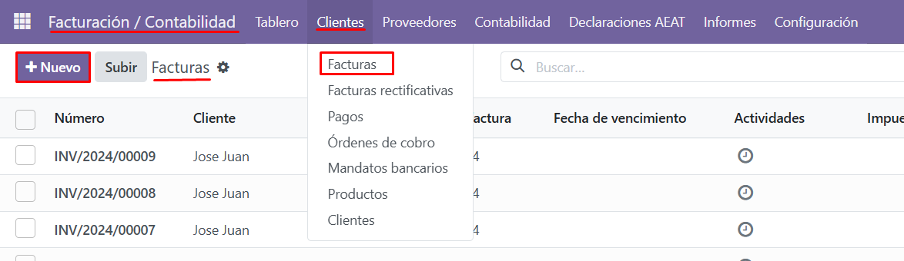
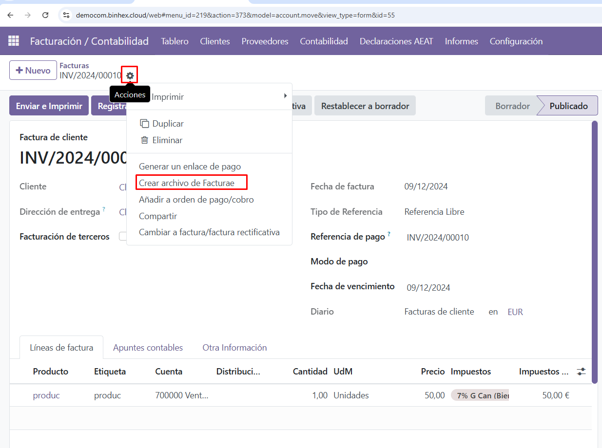
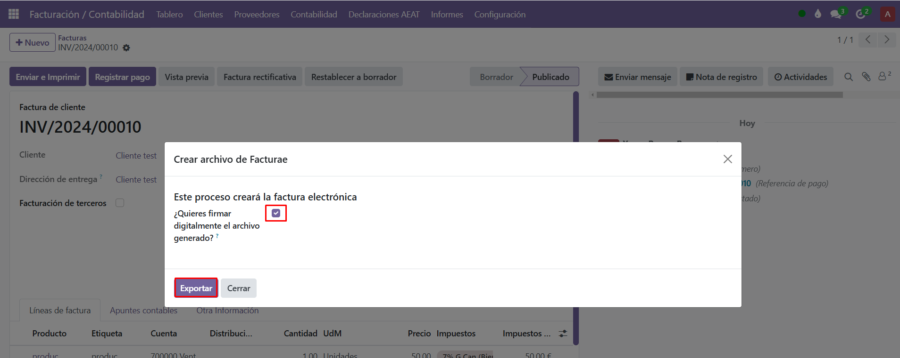

**Descarga el archivo de facturae**

Con la configuración lista, ya puedes proceder a emitir tus facturas electrónicas. Para ello, accede a **Facturación/Contabilidad**, entra en el menú de **Clientes** y selecciona **Facturas**.

Haz clic en **Nuevo** para crear una nueva factura. Completa toda la información necesaria, guarda los datos, y luego selecciona el icono de **engranaje de Acción**.

Aquí encontrarás la opción para descargar el archivo de la factura electrónica. Si es necesario, firma el archivo antes de descargarlo.

Finalmente, una vez que tengas el archivo listo, puedes subirlo al portal **FACe** para completar el proceso.

